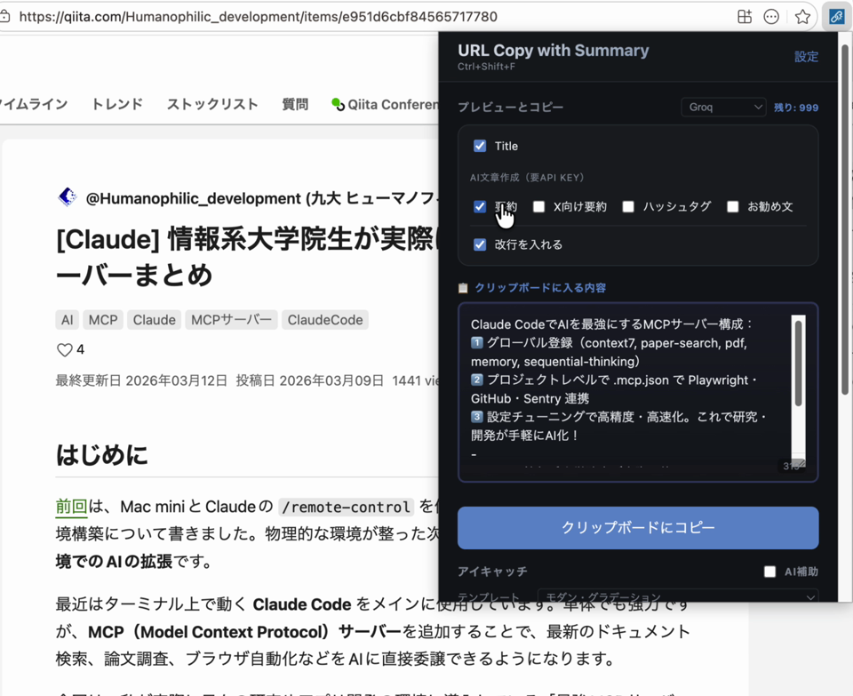

# URL Copy with Summary

様々なフォーマットでのURLコピー、AIによる要約生成、スマートなハッシュタグ抽出、ペルソナを選べる「お勧め文」のAI生成、そして魅力的なSNS用アイキャッチ画像を作成できる、インテリジェントなChrome拡張機能です。

  

> 🎬 [デモ動画を再生](https://github.com/wildriver/url-copy-with-summary/releases/download/v2.5.9/url-copy-with-summary.mp4)

## ✨ v2.5.x の新機能
- **お勧め文（ペルソナ付き）**: 8種類のペルソナ（デフォルト / 先生 / 学生 / 驚き屋 / 研究者 / ライター / 友達 / ビジネスマン）から選んで、ページ内容に基づいた推薦メッセージをAIが生成します。
- **テーマ切り替え**: 設定画面から **ライト**（新規・洗練）/ **ダーク**（新規・洗練・デフォルト）/ **ネオン**（従来）を選択可能。
- **UIの刷新**: 重複していたAI要約ブロックを削除し、チェックボックスで自動生成。Provider選択と残量表示をプレビューヘッダに統合しコンパクト化。
- **設定画面のCloseボタン**: 設定後、ワンクリックでタブを閉じて元の画面に戻れます。
- **アイキャッチ部の2行レイアウト**: 項目名の不自然な折り返しを解消。
- **プレビュー領域の視認性向上**: 「クリップボードに入る内容」というラベルと強調枠で、入力欄と明確に区別。

## 🚀 主な機能
- **3つのテーマ**: 洗練されたライト、洗練されたダーク、従来のネオンから設定画面で選択。
- **バイリンガル対応**: 英語と日本語に完全対応。
- **柔軟なURLコピー**: タイトル、AI要約、X向け140字要約、ハッシュタグ、個人的な推薦文を自由に組み合わせてクリップボードへ。
- **AI要約**: GroqまたはOpenRouterで、長さ・言語を指定して生成。
- **お勧め文（ペルソナ）**: 選んだペルソナの口調で、AIが短い推薦文を作成。
- **アイキャッチ画像生成**: 5種類のテンプレートから1200×630pxの美麗な画像を作成。AI補助で短いキャッチタイトルも生成可能。
- **スマート・フォールバック**: GroqとOpenRouterをレート制限時に自動切替。
- **残量バッジ**: ポップアップ上で残りAPI利用可能回数を確認。
- **Amazon & トラッキングURLの最適化**: `fbclid`、`utm_*` などを自動削除、Amazon商品URLを短縮整形。

## 📥 インストール方法
1. リリースページから最新の [`extension_v2.5.9.zip`](https://github.com/wildriver/url-copy-with-summary/releases/latest) をダウンロード。
2. ファイルを**解凍（展開）**します。
3. Chromeを開き、アドレスバーに `chrome://extensions/` と入力。
4. 画面右上の**「デベロッパーモード」**をオンに。
5. **「パッケージ化されていない拡張機能を読み込む」**をクリックし、解凍した**フォルダ**（`manifest.json` を含むフォルダ）を選択。

## ⚙️ 初期設定
1. 拡張機能のポップアップを開きます。
2. **設定（Settings）**をクリックし、使用するAIプロバイダー（GroqまたはOpenRouter）を選択してAPIキーを入力します。**AI文章作成**グループはAPIキー必須です。
   - **Groqの制限値**: `llama-3.1-8b-instant` は1日あたり最大14,400回。`llama-3.3-70b-versatile` などは1,000回/日。
   - **OpenRouterの制限値**: 無課金（フリー枠）は1日あたり約50回。$10のクレジットをチャージすると1,000回/日以上に増枠。
   - *💡ヒント: 両方のプロバイダーを登録しておくと、片方が制限・障害でも自動でもう一方へフォールバックします。*
3. （任意）**テーマ**を「ライト」「ダーク」「ネオン」から選択。

## 🛠 開発情報
- **Manifest V3**: 最新のChrome拡張機能標準に準拠。
- **Canvas API**: ローカルでの画像生成（プライバシー・パフォーマンスに配慮）。
- **AI統合**: 任意のLLMプロバイダー（Groq、OpenRouter）と連携可能。
- **CSS変数 + テーマ**: `theme.js` が `localStorage` から同期的に読み込み、画面フラッシュなしでテーマを適用。

## 🙏 謝辞
本プロジェクトは、[@ikedaosushi](https://github.com/ikedaosushi) 氏と [Misoni](https://github.com/MISONLN41) 氏によるオリジナルの [Simple URL Copy](https://github.com/MISONLN41/simple-url-copy) をフォークし、拡張したものです。

素晴らしいベースを提供してくださったオリジナル作者の皆様に深く感謝いたします。

---
*Enhanced by URL Copy with Summary.*
